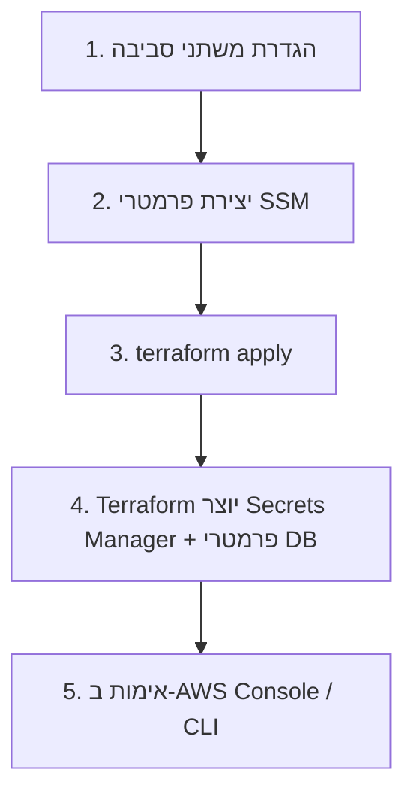

# Bootstrap חד-פעמי — SSM + Secrets Manager

מדריך זה מכין את סביבות **Dev** ו-**Prod** לפני `terraform apply` הראשון.  
אין צורך ב-`secrets.auto.tfvars` או בקבצי סודות מקומיים.

| | |
|--|--|
| **אזור** | `us-east-1` |
| **Prefix Dev** | `/sbl/dev` |
| **Prefix Prod** | `/sbl/prod` |
| **Secret Dev** | `sbl-dev-db/db-credentials` |
| **Secret Prod** | `sbl-prod-db/db-credentials` |

---

## סדר עבודה מומלץ



| שלב | מי מבצע | מה נוצר |
|-----|---------|---------|
| **1–2** | אתם (CLI) | פרמטרי SSM לא רגישים (pipeline, EB stack, app settings) |
| **3** | Terraform | RDS, EB, Pipeline, **Secrets Manager**, פרמטרי `/db/*` |
| **4–5** | אתם | אימות שהכל קיים ותקין |

> **חשוב:** פרמטרי `db/host`, `db/name`, `db/user` **לא** נוצרים ב-bootstrap — Terraform מפרסם אותם אוטומטית אחרי יצירת RDS.

---

## דרישות מקדימות

1. [AWS CLI v2](https://docs.aws.amazon.com/cli/latest/userguide/getting-started-install.html) מותקן ומחובר (`aws sts get-caller-identity`)
2. הרשאות: `ssm:PutParameter`, `ssm:GetParameter`, `secretsmanager:*` (לסיבוב סיסמה), `elasticbeanstalk:ListAvailableSolutionStacks`, `codestar-connections:ListConnections`
3. **CodeStar Connection** ל-GitHub — סטטוס `Available` בקונסול AWS

### משתני סביבה (PowerShell)

העתיקו והתאימו לפני הרצה:

```powershell
$env:AWS_REGION = "us-east-1"
$env:AWS_DEFAULT_REGION = "us-east-1"

# החליפו בערכים האמיתיים שלכם
$GITHUB_REPO = "StarUP-Solutions/SBL-ALLAPP"   # owner/repo
$ACCOUNT_ID  = (aws sts get-caller-identity --query Account --output text)

# שם bucket ייחודי גלובלית — Terraform ייצור אותו אם עדיין לא קיים
$DEV_ARTIFACT_BUCKET  = "sbl-dev-pipeline-artifacts-$ACCOUNT_ID"
$PROD_ARTIFACT_BUCKET = "sbl-prod-pipeline-artifacts-$ACCOUNT_ID"

# ARN של CodeStar Connection (ראו פקודת גילוי למטה)
$CODESTAR_ARN = "arn:aws:codestar-connections:us-east-1:${ACCOUNT_ID}:connection/xxxxxxxx-xxxx-xxxx-xxxx-xxxxxxxxxxxx"

# Solution stack — הריצו את פקודת הגילוי ואז העתיקו שם מדויק
$EB_SOLUTION_STACK = "64bit Amazon Linux 2023 v4.3.0 running Docker"
```

### גילוי ערכים אוטומטי

```powershell
# Account ID
aws sts get-caller-identity --query Account --output text

# CodeStar Connections
aws codestar-connections list-connections --region us-east-1 `
  --query "Connections[?ConnectionStatus=='AVAILABLE'].{Name:ConnectionName,Arn:ConnectionArn}" `
  --output table

# Elastic Beanstalk Docker solution stacks (Graviton / AL2023)
aws elasticbeanstalk list-available-solution-stacks --region us-east-1 `
  --query "SolutionStacks[?contains(@, 'Amazon Linux 2023') && contains(@, 'Docker')]" `
  --output table
```

---

## אפשרות א': סקריפטים מוכנים (מומלץ)

```powershell
cd terraform\scripts

# ערכו את המשתנים בראש הקובץ, ואז:
.\bootstrap-dev.ps1
.\bootstrap-prod.ps1
```

לאחר מכן:

```powershell
cd ..\environments\dev
terraform init
terraform plan
terraform apply
```

---

## אפשרות ב': פקודות AWS CLI ידניות

### Dev — SSM Parameter Store

```powershell
aws ssm put-parameter --region us-east-1 `
  --name "/sbl/dev/eb/solution_stack_name" `
  --type "String" `
  --value "64bit Amazon Linux 2023 v4.3.0 running Docker" `
  --overwrite `
  --description "Elastic Beanstalk Docker solution stack (dev)"

aws ssm put-parameter --region us-east-1 `
  --name "/sbl/dev/pipeline/source_repo" `
  --type "String" `
  --value "StarUP-Solutions/SBL-ALLAPP" `
  --overwrite `
  --description "GitHub monorepo for CodePipeline source"

aws ssm put-parameter --region us-east-1 `
  --name "/sbl/dev/pipeline/frontend_repo" `
  --type "String" `
  --value "StarUP-Solutions/SBL-ALLAPP" `
  --overwrite `
  --description "Frontend repo for CodeBuild clone (dev → branch staging)"

aws ssm put-parameter --region us-east-1 `
  --name "/sbl/dev/pipeline/artifact_bucket_name" `
  --type "String" `
  --value "sbl-dev-pipeline-artifacts-036318543774" `
  --overwrite `
  --description "S3 bucket name for CodePipeline artifacts (dev)"

aws ssm put-parameter --region us-east-1 `
  --name "/sbl/dev/pipeline/codestar_connection_arn" `
  --type "String" `
  --value "arn:aws:codestar-connections:us-east-1:036318543774:connection/xxxxxxxx" `
  --overwrite `
  --description "CodeStar connection ARN for GitHub (dev)"

aws ssm put-parameter --region us-east-1 `
  --name "/sbl/dev/app/app_env" `
  --type "String" `
  --value "dev" `
  --overwrite `
  --description "Application environment label"

aws ssm put-parameter --region us-east-1 `
  --name "/sbl/dev/app/log_level" `
  --type "String" `
  --value "DEBUG" `
  --overwrite `
  --description "Application log level (dev)"
```

### Prod — SSM Parameter Store

```powershell
aws ssm put-parameter --region us-east-1 `
  --name "/sbl/prod/eb/solution_stack_name" `
  --type "String" `
  --value "64bit Amazon Linux 2023 v4.3.0 running Docker" `
  --overwrite `
  --description "Elastic Beanstalk Docker solution stack (prod)"

aws ssm put-parameter --region us-east-1 `
  --name "/sbl/prod/pipeline/source_repo" `
  --type "String" `
  --value "StarUP-Solutions/SBL-ALLAPP" `
  --overwrite `
  --description "GitHub monorepo for CodePipeline source"

aws ssm put-parameter --region us-east-1 `
  --name "/sbl/prod/pipeline/frontend_repo" `
  --type "String" `
  --value "StarUP-Solutions/SBL-ALLAPP" `
  --overwrite `
  --description "Frontend repo for CodeBuild clone (prod → branch main)"

aws ssm put-parameter --region us-east-1 `
  --name "/sbl/prod/pipeline/artifact_bucket_name" `
  --type "String" `
  --value "sbl-prod-pipeline-artifacts-036318543774" `
  --overwrite `
  --description "S3 bucket name for CodePipeline artifacts (prod)"

aws ssm put-parameter --region us-east-1 `
  --name "/sbl/prod/pipeline/codestar_connection_arn" `
  --type "String" `
  --value "arn:aws:codestar-connections:us-east-1:036318543774:connection/xxxxxxxx" `
  --overwrite `
  --description "CodeStar connection ARN for GitHub (prod)"

aws ssm put-parameter --region us-east-1 `
  --name "/sbl/prod/app/app_env" `
  --type "String" `
  --value "prod" `
  --overwrite `
  --description "Application environment label"

aws ssm put-parameter --region us-east-1 `
  --name "/sbl/prod/app/log_level" `
  --type "String" `
  --value "INFO" `
  --overwrite `
  --description "Application log level (prod)"
```

---

## Secrets Manager — RDS credentials

### ברירת מחדל: Terraform יוצר את ה-Secret

ב-`terraform apply` הראשון, מודול RDS יוצר אוטומטית:

| סביבה | שם Secret | מבנה JSON |
|-------|-----------|-----------|
| Dev | `sbl-dev-db/db-credentials` | `username`, `password`, `engine`, `dbname` |
| Prod | `sbl-prod-db/db-credentials` | אותו מבנה |

הסיסמה נוצרת אוטומטית (`random_password`) ונשמרת ב-Secrets Manager.  
**אין צורך ליצור את ה-Secret ידנית לפני apply ראשון.**

### אימות אחרי `terraform apply`

```powershell
# Dev
aws secretsmanager describe-secret --region us-east-1 --secret-id "sbl-dev-db/db-credentials"
aws secretsmanager get-secret-value --region us-east-1 --secret-id "sbl-dev-db/db-credentials" `
  --query "SecretString" --output text | ConvertFrom-Json | Select-Object username, engine, dbname

# Prod
aws secretsmanager describe-secret --region us-east-1 --secret-id "sbl-prod-db/db-credentials"
aws secretsmanager get-secret-value --region us-east-1 --secret-id "sbl-prod-db/db-credentials" `
  --query "SecretString" --output text | ConvertFrom-Json | Select-Object username, engine, dbname
```

> אל תדפיסו את השדה `password` בלוגים משותפים. השתמשו ב-`Select-Object` ללא password לאימות בלבד.

### אימות פרמטרי DB ב-SSM (נוצרים ע"י Terraform)

```powershell
aws ssm get-parameters-by-path --region us-east-1 --path "/sbl/dev/db" --recursive --output table
aws ssm get-parameters-by-path --region us-east-1 --path "/sbl/prod/db" --recursive --output table
```

---

## (אופציונלי) יצירת Secret ידנית לפני Terraform

השתמשו רק אם אתם **מייבאים** RDS קיים או רוצים לשלוט בסיסמה מראש.  
שם ה-Secret **חייב** להתאים לשם ב-Terraform (`sbl-dev-db` / `sbl-prod-db`).

### Dev

```powershell
# יצירת סיסמה חזקה (PowerShell)
$DevDbPassword = -join ((48..57 + 65..90 + 97..122) | Get-Random -Count 28 | ForEach-Object { [char]$_ })
$DevDbPassword += "!#"

$DevSecretJson = @{
  username = "sbl_admin"
  password = $DevDbPassword
  engine   = "postgres"
  dbname   = "sbl_dev"
} | ConvertTo-Json -Compress

aws secretsmanager create-secret --region us-east-1 `
  --name "sbl-dev-db/db-credentials" `
  --description "PostgreSQL credentials for sbl-dev-db" `
  --secret-string $DevSecretJson `
  --tags Key=Environment,Value=dev Key=Project,Value=SBL Key=ManagedBy,Value=Terraform

# אם ה-Secret כבר קיים — עדכון גרסה:
aws secretsmanager put-secret-value --region us-east-1 `
  --secret-id "sbl-dev-db/db-credentials" `
  --secret-string $DevSecretJson

# ניקוי מהזיכרון
Remove-Variable DevDbPassword, DevSecretJson -ErrorAction SilentlyContinue
```

### Prod

```powershell
$ProdDbPassword = -join ((48..57 + 65..90 + 97..122) | Get-Random -Count 28 | ForEach-Object { [char]$_ })
$ProdDbPassword += "!#"

$ProdSecretJson = @{
  username = "sbl_admin"
  password = $ProdDbPassword
  engine   = "postgres"
  dbname   = "sbl_prod"
} | ConvertTo-Json -Compress

aws secretsmanager create-secret --region us-east-1 `
  --name "sbl-prod-db/db-credentials" `
  --description "PostgreSQL credentials for sbl-prod-db" `
  --secret-string $ProdSecretJson `
  --recovery-window-in-days 30 `
  --tags Key=Environment,Value=prod Key=Project,Value=SBL Key=ManagedBy,Value=Terraform

aws secretsmanager put-secret-value --region us-east-1 `
  --secret-id "sbl-prod-db/db-credentials" `
  --secret-string $ProdSecretJson

Remove-Variable ProdDbPassword, ProdSecretJson -ErrorAction SilentlyContinue
```

> אם יצרתם Secret ידנית, Terraform יזהה אותו ב-apply (או תצטרכו `terraform import`).  
> מומלץ לרוב הצוותים: **לא** ליצור ידנית — להריץ `terraform apply` בלבד.

---

## סיבוב סיסמת DB (לאחר פריסה)

```powershell
# 1. סיסמה חדשה
$NewPassword = -join ((48..57 + 65..90 + 97..122) | Get-Random -Count 28 | ForEach-Object { [char]$_ }) + "!#"

# 2. עדכון ב-RDS (דוגמה dev)
aws rds modify-db-instance --region us-east-1 `
  --db-instance-identifier "sbl-dev-db" `
  --master-user-password $NewPassword `
  --apply-immediately

# 3. עדכון ב-Secrets Manager (שמרו את שאר השדות)
$Current = aws secretsmanager get-secret-value --region us-east-1 `
  --secret-id "sbl-dev-db/db-credentials" --query SecretString --output text | ConvertFrom-Json
$Current.password = $NewPassword
$Updated = $Current | ConvertTo-Json -Compress

aws secretsmanager put-secret-value --region us-east-1 `
  --secret-id "sbl-dev-db/db-credentials" `
  --secret-string $Updated

Remove-Variable NewPassword, Current, Updated -ErrorAction SilentlyContinue
```

---

## Checklist לפני `terraform apply`

### Dev
- [ ] כל 7 פרמטרי `/sbl/dev/*` קיימים (`aws ssm get-parameters-by-path --path /sbl/dev`)
- [ ] `solution_stack_name` תואם ל-stack זמין ב-`us-east-1`
- [ ] `codestar_connection_arn` במצב `Available`
- [ ] `artifact_bucket_name` ייחודי גלובלית
- [ ] `terraform init && terraform plan` ב-`environments/dev` ללא שגיאות SSM

### Prod
- [ ] כל 7 פרמטרי `/sbl/prod/*` קיימים
- [ ] `office_cidr_blocks` מוגדר ב-`variables.tf` או override (אם נדרש)
- [ ] `terraform plan` ב-`environments/prod`

### אחרי Apply
- [ ] Secret `sbl-*-db/db-credentials` קיים
- [ ] פרמטרים `/sbl/*/db/host|name|user` קיימים
- [ ] Beanstalk environment מציג `DB_PASSWORD` כ-dynamic reference (לא plain text בקונסול)
- [ ] Push לענף `dev` / `main` מפעיל Pipeline

---

## פתרון בעיות

| שגיאה | סיבה | פתרון |
|-------|------|--------|
| `ParameterNotFound` ב-plan | פרמטר SSM חסר | הריצו `bootstrap-*.ps1` או `put-parameter` ידנית |
| `SolutionStackNotFound` | שם stack לא מעודכן | עדכנו `/sbl/*/eb/solution_stack_name` |
| CodePipeline לא מוצא repo | `source_repo` שגוי | ודאו פורמט `owner/repo` ללא `https://` |
| Secret כבר קיים | bootstrap ידני + terraform | `terraform import` או מחקו secret ב-dev בלבד |

---

*אין לשמור סיסמאות, ARNs או Account IDs ב-Git. נהלו ערכים רגישים רק ב-AWS Console / CLI.*
